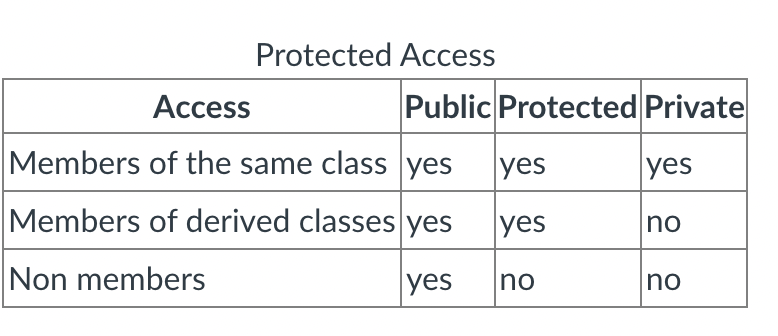
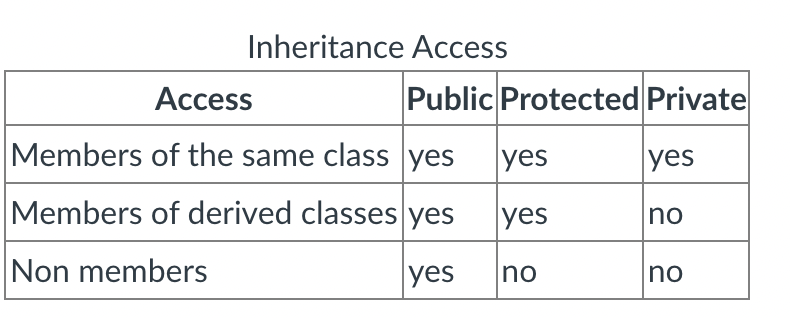

# Unit 12 - Inheritances

* We can bundle data along with functions that operate on the data to create an efficient object

* We have a system in software development because we are complexity challenged
    * High cost of development
        * Once a program is up and running, it's a lot easier to maintain than developing new system
    * Highly organized code is much easier to modify and maintain that code that is thrown together in a sloppy fashion

* Stepwise refinement
    * Problems were broke down into functions

## Types of Organizations

* Object-Oriented Programming
1. Communities - Also called a "uses" relationship
2. Composition - Also called a "hasa" relationsihp
3. Inheritance - Also known as a "isa" relationship

### Communities

* Objects offer their services and request the services of other objects
    * Client / Server type relationship
        * One object act as a director and send and receives requests from other objects

* C## and Visual Basic use this model   
    * Form gets created and filled with components such as buttons and text boxes 

### Composition

* An insstance of another object is declared inside the data section of another class

```cpp
struct Person
{
string first;
string last;
string address;
};
class People
{
private:
   vector<Person> people;
public:
    void addPerson(string first, string last, string address);
    string getFirst();
    string getLast();
    string getAddress();
}; 
```

* The people class "hasa" vector within

### Inheritance

* Allows you to create a specialized version of an object
    * Flying car
        * Make the simple car first, then make it fly

* They include the parent's members along with their own
    * Shapes
        * Rectangle is a polygon, triangle is a polygon. Polygon describes height and base 

### Subclasses

* Rectangle and Triangle are children of Polygon
    * Parent / child relationship is also called superclass and subclass
    * A Rectangle or triangle is a polygon, but not every polygon is a rectangle or triangle

```cpp
class Triangle: public Polygon
();
```

* Use a colon to designate parent class

```cpp
#include <iostream>

using namespace std; 

class Polygon 
{
protected: 
    int width; 
    int height; 

public: 
    void setValues(int height, int width);  
};

class Rectangle : public Polygon 
{
public: 
    int area();  
};
void Polygon::setValues(int height, int width) 
{
    this->height = height; 
    this->width = width; 
}
int Rectangle::area() 
{
    return this->height * this->width; 
}
int main() 
{
int length, width; 

    cout << "Enter the length and width" << endl; 
    cin >> length >> width;
 
   Rectangle r;
   r.setValues(length, width);

   cout << "The area is " << r.area() << endl; 
   return 0;
}  
```

* Base class which includes a member A and derive another class from A with a member called B, the derived class will contain both members A and B

### Protected

* Similar to private where it restricts access to anything outside the class
    * Allows members to be accessed by derived classes 



### Inheritance Relationships

```cpp
class Rectangle::public Polygon
{
}; 
```

* Inheritance can also be public, private, or protected



* Access
    * Public: The derived class will inherit all the members from the base class maintaining their access levels
    * Protected: All public members in base are inherited as protected in derived class
    * Private: All public members in base are inherited as private in derived class

* The public keyword after the colon (:) denotes the minimum level access level for all the members inherited from the class that follows it
    * The derived class will inherit all of the members with the same levels they had in the base class

### What is Inherited?

* A derived class inherits every member of a base class except:

    * constructor and destructor
        * default constructor and destructor are always called when a new object is created or destroyed
        * If the base class has no default constructor, you can specify it in the constructor definition of the new class
        ```derivedContructor(parameters) :    baseConstructor(parameters){...} ```
    * operator=() members
    * friends 

```cpp
#include <iostream>
using namespace std; 

class mother 
{
public : 
    mother () { cout << "mother: no parameters\n"; }
    mother(int a) { cout << "mother: int parameter\n"; } 
}; 
class daughter : public mother 
{
public: 
     daughter (int a) { cout << "daughter: int parameter\n\n"; } 
};
class son : public mother 
{
public: 
    son (int a) : mother (a) { cout << "son: int parameter\n\n"; } 
};
int main () 
{
 daughter cynthia (0);
 son daniel(0);
 return 0; 
} 
```

```cpp
daughter(int a) // call mother default constructor
son(int a) : mother(a) // call mother overloaded  constructor passing a
```

### Multiple Inheritance

```cpp
class Rectangle : public Polygon, public Output;
class Triangle : public Polygon, public Output;
```

```cpp
#include <iostream>

using namespace std;

class Polygon
{
protected:
    int width, height; 

public:
    void set_values (int a, int b) { width=a; height=b;}

};

class Output
{
public:
    void output (int i);
};

void Output::output (int i)
{
   cout << i << endl;
}

class Rectangle: public Polygon, public Output 
{
public:
   int area () { return (width * height); }
};

class Triangle: public Polygon, public Output
{
public:
   int area () { return (width * height / 2); }

}; 

int main ()
{
Rectangle rect;
Triangle trgl;  

   rect.set_values (4,5);
   trgl.set_values (4,5);
   rect.output (rect.area());
   trgl.output (trgl.area());

   return 0; 

}  
```
