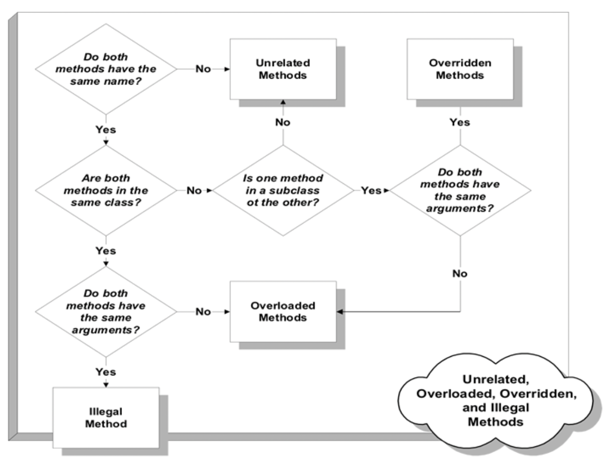
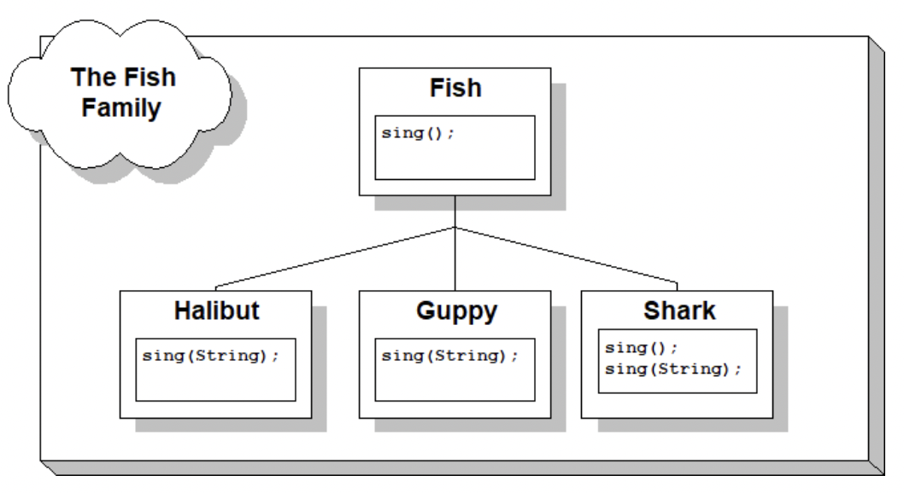

# Unit 13 - Polymorphism

* Means that one object can have many different meanings
    * When we create classes we want to generalize things
    * Remove the redundant code and put it in the base class

```cpp 
class Polygon
{
protected:
	int width, height;
public:
	
	void center();
};
void Polygon::center()
{
	...
	draw();
	...
}
class Rectangle : public Polygon
{
public:
	void draw();
};
class Triangle : public Polygon
{
public:
	void draw();
};
```

* How does it know which one to call?

## Overloaded revisisted

* Same function name but different parameters

```cpp
#include <iostream>

using namespace std; 

int main()
{
int x,y,z; 

   cout << "Enter 3 integers " << endl;
   cin >> x >> y >> z;

   cout << "The sum of the first two is " << addEm(x, y) << endl;
   cout << "The sum of all Three is " << addEm(x, y, z) << endl;  

}

int addEm(int a, int b)
{
    return a + b;
}
int addEm(int a, int b, int c)
{
   return addEm(addEm(a,b), c);
}  
```

* Because of the "isa" relationship it is possible to have overloaded functions where some appear in the base class and others appear in the derived class.

```cpp
class father
{
public:
    void saySomething();    // Base class saySomething function
};
class son : public father
{
public:
    void saySomething(string sentence);
};
```

## How to determine

* Overloaded functions - Functions that have the same name but different parameter lists. Can be together or separate in the base and derived class



* Overriden functions - functions that have the same name and parameter list. One function is in the base class, the other is in the derived



## Virtual Functions

* A class member function declared using the "virtual" keyword
    * A pointer to derived class object can be assigned to a base class instance
    * A virtual function can than be called from the base class pointer
    * The correct function will be called based on what the base class pointer "really" points at

```cpp
Shape *p= new Line(0.1, 0.1, blue,0.4,0.4);
p->draw();
```

* Polymorphism gives the type the ability to appear and behave as another type

```cpp
class Shape
{
protected:
    int width;
    int height;

public:
    void setValues(int height, int width);
    void center():
    virtual void draw();
};
void Shape::setValues(int height, int width)
{
    this->height = height;
    this->width = width;
}
void Shape::center()
{
    cout << "Move to x, y" << endl;
    draw();
}
void Shape::draw()
{
    cout << "Draw a Shape" << endl;
}

// The Rectangle class
class Rectangle : public Shape
{
public:
    void draw();
}
void Rectangle::draw()
{
    cout << "Drawing a Rectangle" << endl;
}

int main()
{
    Rectangle r;
    r.center();
 
    return 0;
}
```

* The center function will call the virtual function draw

## Pure Virtual Functions

* Abstract Classes - classes that you cannot create an instance of. Inheritance purposes only
* Concrete classes - You create instances of. Classes used up to this point

* Pure virtual functions create a prototype in teh class definition, and the derived class must implement the functiion
    * Forces the user of the class to implement the function
    * Shape class; no idea what shapes will be added and how to draw them. A contract

```cpp
#include <iostream>

using namespace std;

class Shape
{

public:
    virtual void draw()=0;
};

class Rectangle : public Shape
{
private:
    int length, width;

public:
    virtual void draw();
};
void Rectangle::draw()
{
    cout << "I am a rectangle" << endl;
}
int main()
{

    Rectangle *r = new Rectangle;  
    Shape *s = r;
    s->draw();

   return 0;
}
```

```cpp
virtual void draw() = 0;
```

* Placing the 0 means that this is a pure virtual function

## Copy Constructors

```cpp
char str[] = "Hello World";
char *p1 = str;
char *p2 = p1;
```

* Both p1 and p2 refer to the same memory location that contains str
    * Shallow copy

```cpp
char str[]= "Hello World";
char *p1 = str;
char *p2 = new char[strlen(str) + 1];
strcpy(p2, p1);
```

* To get a copy of what p1 is pointing at, p2 must allocate memory
    * Deep copy
    * Identical strings stored in separate memory locations

* Special constructor that takes its argument as a reference to an object of the same class and creates a new object that is a copy
    * Performs member-by-member copy from the original object to the one being created

```cpp
#include <iostream>

using namespace std;

class Person
{
public:
	Person(const Person &p);
	Person(char *name, int age);
	~Person();
	char *getName()const { return name; }

	//Other Accessor methods 

private:
	char *name;
	int age;
};
Person::Person(char *name, int age)
{
	// Allocate memory for the pointer
	this->name = new char[strlen(name)];
		
	// create the deep copy
	strcpy_s(this->name, strlen(name) + 1, name);
	this->age = age;

}
Person::Person(const Person &p)
{
	// Allocate memory for the pointer
	this->name = new char[strlen(p.name)];

	// create the deep copy
	strcpy_s(this->name, strlen(name) + 1, p.name);
	this->age = p.age;

}
Person::~Person()
{	
	delete[] name;
}
int main()
{
	Person pn("Glenn Stevenson", 21);
	Person programmer(pn);
	cout << programmer.getName() << endl;
	return 0;
}
```


