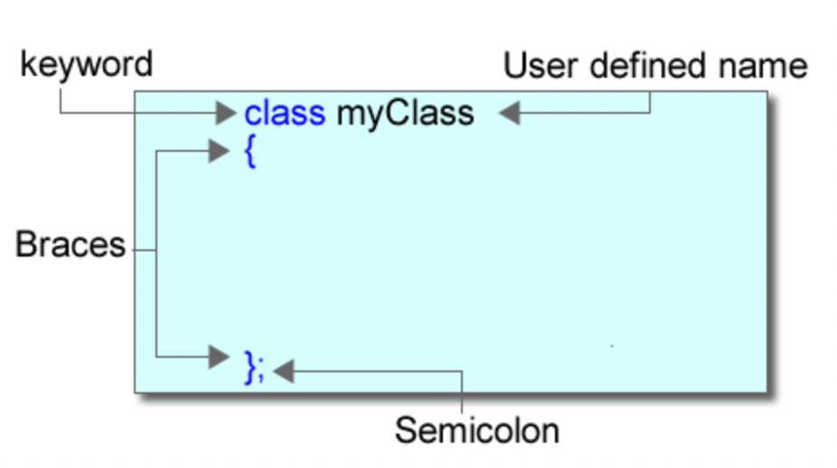
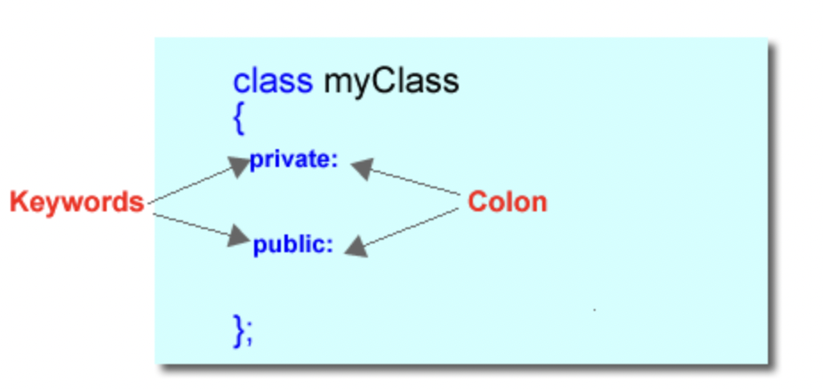
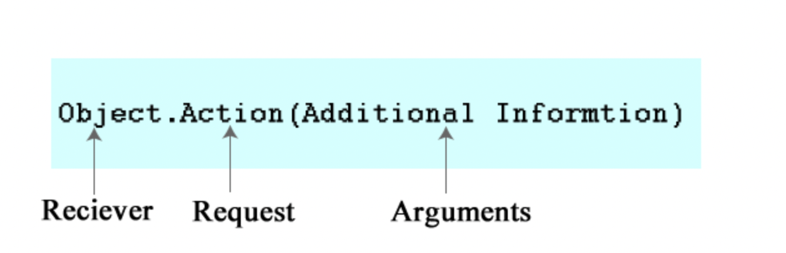

# Unit 2 - Introduction to Classes

## Classes

### Data and Functions

* OOP is a different approach to solving problems
    * Before, there was no way of bundling data with operations

* Objects are an instance of a class
    * You create an instance of a primitive data type: `int myInt;`

* A class is a blueprint for an object
    * You are creating your own data type
    * It is called a complex type as it is a type not built into the language the way primitives are

* Classes are data-centric
    * A class has data and fucntions that operate on the data

* Objects have three characteristics:
    * State
    * Behavior
    * Identity



* Syntax is similar to structs
    * C++ is just modifications to C, C with classes

### Encapsulation

* Means bringing together
    * Bringing data and functions that operate on the data together into a class
    * Allows you to hide the details of the class i.e. don't need to worry about how a car works to drive

### Public and Private

* Class definitions can be
    * Public
    * Private
    * Protected



* Private section: Anything you don't want outside functions or classes to access
    * The attributes (data) of the class should be private because you want to be able to control how they are accessed and modified
    * Public function, private data

```cpp
// Rectangle.h
#ifndef Rectangle
#define Rectangle

class Rectangle
{
private:
   int length, width;

public:
   void setValues(int len, int wid);
   int area();
};
```

* The two functions define the behaviors of the class

```cpp
int main()
{
    Rectangle rect;  // Create an instance of a Rectangle called rect
    cout << rect.length << endl;     // This is an error because length is private and main is not a member of Rectangle
}
```

* Classes are typically put into header files because the compiler needs to see a definition of everything before it compiles it
    * You can put all your definitions into the header file, then just include the header file in any .cpp files that need it

### Just Prototypes

* Still need to prototype all your functions, but now they need to be put as part of the class

```cpp
// Rectangle.cpp
#include <iostream>
#include "Rectangle.h"

void Rectangle::setValues(int len, int wid)
{
   length = len;
   width = wid;
}

int Rectangle::area()
{
   return length * width;
}
```

### The Scope Resolution Operator ::

* Employed to tell the compiler what class the function belongs to 
    * Without it, the code will not build as you have not created the functions that are defined in your class

### Classes to Objects

* Classes are blueprints for objects, they don't actually occupy any space in memory

```cpp
Rectangle x,y,z;
```

* Just like creating variables

```cpp
#include <iostream>
#include "Rectangle.h"

using namespace std;
int main()
{
Rectangle r1, r2;  // Two instances of the Rectangle are created

    cout << "Enter a length and a width for the first rectangle" << endl;
    int l, w;
    cin >> l >> w;
    r1.setValues(l, w);
    cout << "The area of the first Rectangle is " << r1.area() << endl;

    cout << "Enter a length and a width for the second rectangle" << endl;
    cin >> l >> w;
    r2.setValues(l, w);
    cout << "The area of the first Rectangle is " << r2.area() << endl;

    return 0;
}
```

### Messages

* In OOP it is said that you send an object messages; a request for an action



* The action is the function name and it is separated from the object by a dot (.)
    * It is nothing more than invoking (calling) a function that is a member of an object

```cpp
Rectangle rect;
rect.setValues(5, 6);  // Send the rect object the setValues message. 
```

* If you are using pointers you need to use the arrow operator

```cpp
void printArea(Rectangle *rect)
{
    cout << rect->area() << endl;
}
```

### Accessor and Mutator

* Public functions that control private data, so that the programmer controls how the data gets set
    * Accessor - is a function that accesses or returns data from the private section
    * Mutator - is a function that modifies the data in the private section

* Since accessors simply return private data, it is appropriate to make them constant as they won't change any data

```cpp
int Rectangle::area() const
{
   return length * width;
}
```

### Consstructors

* Use the `this` pointer to access members of the current object from within the object

```cpp
#include <iostream>
#include "Rectangle.h"

void Rectangle::setValues(int length, int width)
{
    this->length = length;
    this->width = width;
}

int Rectangle::area()
{
    return this->length * this->width;
}
```

* Without the `this` keyword the code would look like this

```cpp
#include <iostream>
#include "Rectangle.h"

void Rectangle::setValues(int length, int width)
{
    length = length;
    width = width;
}
```

* This code just sets the formal parameters to themselves
* Many have the philosophy that whenever you access variables of the class, that you use the `this` keyword

### Constructor

* Classes are the blueprints of an object
    * Constructors is the factory that builds the object 
    * Constructors are used as the mechanism to initialize the variables in an object to some reasonable value

* Three properties
    * Constructors are always defined as public
        * It is possible to have a private constructor but then there is no way to construct the object publically
    * Same name as the class
    * No return type, not even void

```cpp
// Rectangle.h
#ifndef RECTANGLE
#define RECTANGLE

class Rectangle
{
    private:
        int length;
        int width;
    public:
        void setValues(int length, int width);
        int area(); Rectangle();// Constructor definition
};

#ifndef
```

```cpp
// Rectangle.cpp

Rectangle::Rectangle()
{
    this->length = 0;
    this->width = 0;
}
```

* You can use an initialization list instead and is preferred in C++

```cpp
ClassName::ConstructorName() : variableNames(value to set) { }
```

```cpp
Rectangle::Rectangle() : length(0), width(0) { } 
```

* While not recommended, it is possible to put code in the header file, but only do it when the function you're writing contains very small amount of code

```cpp
//Rectangle.h
#ifndef Rectangle
#define Rectangle

class Rectangle
{
    private:
        int length;
        int width;        
    public:
        int area();
        void setValues(int length, int width);
        Rectangle() : length() , width(0){} // Initialize attributes with constructor
};
```

* You can also overload constructors    

```cpp
// Rectangle.cpp
    
Rectangle::Rectangle() : length(1), width(1) { }
Rectangle::Rectangle(int len, int wid) : length(len), width(wid) { }
```

```cpp
int main()
{
    Rectangle rectA; // Construct with default constructor
    Rectangle rectB(5, 6); // Construct Rectangle setting length to 5 and width to 6 return 0;
} 
```

* Default constructor: No arguments
* Working constructor: Takes on all the possible settings

### Delegating constructors

* Prior to version 11.0, you could not have one constructor call another in C++
    * In Java, the practice is to always have every constructor call the working constructor
    * Added in 11.0 is delegating constructors

```cpp
// Rectangle.cpp
    
Rectangle::Rectangle() :Rectangle(1,1) { }
Rectangle::Rectangle(int len) : Rectangle(len, 1) { }
Rectangle::Rectangle(int len, int wid) :length(len), width(wid) { }
```

* You must call the delegating constructor from the initialization list, not the body

### Initialization within Class Definition

* Also new to version 11.0 is initalizing variables in the class

```cpp
// Rectangle.h

#ifndef RECTANGLE
#define RECTANGLE

class Rectangle
{
    private:
        int length = 1; //Initialize attributes in definition
        int width = 1;
    public:
        Rectangle();
        Rectangle(int len);
        Rectangle(int len, int wid);
        void setValues(int len, int wid);
        int area();
};

#endif
```

* Uniform initialization: Call the constructors using curly braces
```cpp
int main()
{
    Rectangle r{ 3, 5 };
    
    return 0;
}
```

### Constructor Notes

* With overloaded constructor, this is how to initalize an object

```cpp
Rectangle rect(2, 3); // This is correct
```

* With default constructor, this is how to initialize an object, no parentheses

```cpp
Rectangle rect; // Also correct
```

* Calling it like a function doesn't work because the constructor gets called automatically when the object is created

```cpp
Rectangle rect;
rect.Rectangle(5,6);
```

### Destructors

* Like how constructors are used to initialize an object, a destructor is used to clean up an object
    * A destructor gets called when an object is removed from memory
        * When the program ends or an object created dynamically is deleted from memory using the delete operator

* Same three properties as constructor

* Destructor is prefixed with a ~ (tilde)

```cpp
#ifndef RECTANGLE
#define RECTANGLE
class Rectangle
{
    private:
        int length;
        int width;
    public:
        Rectangle();
        void setValues();
        int area();
        // Rectangle destructor
        ~Rectangle();
};
```

* Use case could be like an elevator class; after using the elevator, you might want the elevator to return to ground floor

## Debug

* A debugger does not catch compiler errors; that's what the compiler does
    * Debugger gives you the tools needed to find logic errors in your code

* There are two ways to build a project, for debug and release
    * When a project is built for debugging, debug symbols are added to a .pdb file
    * When you are done debugging, you should build for release