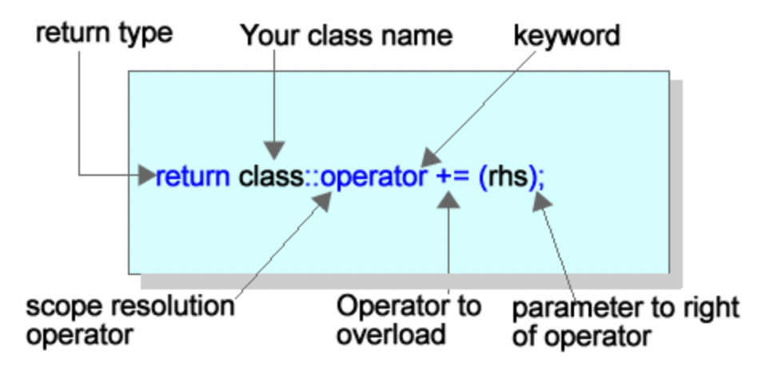

# Unit 5 - Operator Overloading

* You can overload functions to accept different data types as parameters
    * In the same way, you can overload functions so that it works with your data type

## Operator Overloading



* After writing the function normally, place the keyword operator after the scope resolution operator and replace the function name with the operator you want to overload

```cpp
Rectangle Rectangle::add(const Rectangle &r)
{
}
```

* After overloading the function with the + operator

```cpp
Rectangle Rectangle::operator +(const Rectangle &r)
{
}
```

### About Passing Parameters

* When you pass complex types (classes, etc.) you want to pass them by reference
    * By default C++ passes everything by value
    * What is more efficient: passing one 32-bit address on the stack or an entire object?
    * Pass as a const so the mutator method does not change it

```cpp
//Rectangle.h
class Rectangle
{
private:
	int length;
	int width;

public:
	Rectangle(int length, int width);
	Rectangle() :length(0), width(0) {}
	int area();

	void setValues(int length, int width);  //Mutator
	int getLength();   //Accessor
	int getWidth();    //Accessor

	Rectangle add(const Rectangle &r);
	Rectangle operator +(const Rectangle &r);
};
```

```cpp
//Rectangle.cpp
#include <iostream>
#include "Rectangle.h"

void Rectangle::setValues(int length, int width)
{
	this->length = length;
	this->width = width;
}
int Rectangle::getLength()
{
	return this->length;
}
int Rectangle::getWidth()
{
	return this->width;
}
Rectangle Rectangle::add(const Rectangle &r)
{
	Rectangle tmp(this->getLength() + r.getLength(), 
		this->getWidth() + r.getWidth());
	return tmp;
}
Rectangle Rectangle::operator +(const Rectangle &r)
{
	return this->add(r);
}
int Rectangle::area()
{
	return this->getLength() * this->getWidth();
}
```

* Since Rectangle can be const, any function that is called should also be const
    * The const declaration also neesd to be said in the header file

* The value of one Rectangle is added to another and then assigned 

```cpp
Rectangle Rectangle::add(const Rectangle &r)
{
	Rectangle tmp(this->getLength() + this->getLength(), 
		this->getWidth() + this->getWidth());
	return tmp;
}
Rectangle Rectangle::operator +(const Rectangle &r)
{
	return this->add(r);
} 
```

* When a call is made

```cpp
Rectangle r1(2,3), r2(3,4), r3;
r3 = r1 + r2;
```

### Overloading the assignment operator

```cpp
Rectangle& Rectangle::operator = (const Rectangle &r)
{
   return this->equal(r);
}
Rectangle &Rectangle::equal(const Rectangle &r)
{
     this->setValue(r.getLength(), r.getWidth());
    return *this;
}
```

* We want to return the object as a refernece so the current object pointer needs to be dereferenced from

### Chaining

```cpp
Rectangle r1, r2, r3(2,4);
r1 = r2 = r3; 
```

* Assignment goes from right to left
    * Overloaded operator allows r3 to be assigned ot r2 but then r2 would then need to be returned in order for it to be assigned to r1

### A Couple More Examples

```cpp
Rectangle &Rectangle::operator+=(const Rectangle &r)
{
   this->length+=r.getLength();
   this->width+= r.getWidth();
  return *this;
}
```

* Also returns the object by dereferencing this, to allow the code to work

```cpp
Rectangle r1(2, 3), r2(1, 1), r3;
r3 = r1+= r2;
```

### Overload the Equality Operator

```cpp
bool Rectangle::operator==(const Rectangle &r)
{
   return (this->getLength() == r.getLength()) && (this->getWidth() == this->getWidth()); 
}
```

```cpp
if(r1 == r2) 
```

### Overloading overloaded functions

```cpp
bool Rectangle::operator == (int theArea)
{
      return this->area() == theArea;
} 
```

* Example: You wante to check if both length and width were the same, as well as the area


