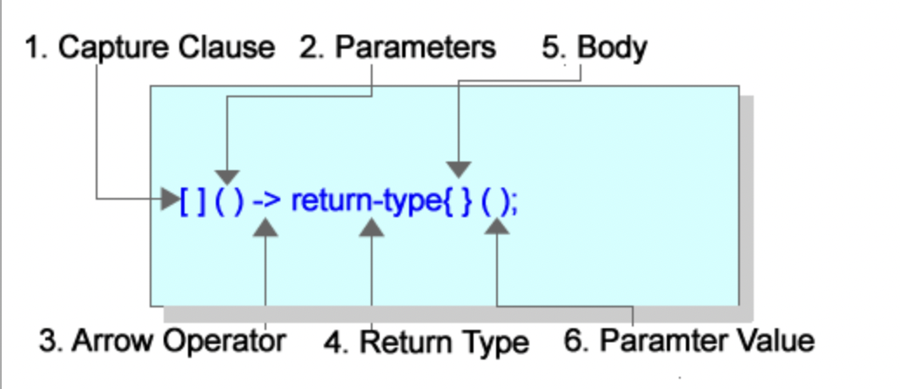

# Unit 6 - Friend Functions

* C++ programming language was created long before any agreement on rules for OOP was drawn up. Friend functions violate current thinking
    * Allows outside functions to have access to private data

## Friend Functions

* It is frowned upon but can be useful in certain cases
    * A good reason to use it would be to add stream functionality to your class

```cpp
Rectangle rect
cin >> rect;
cout << rect << endl;
```

* You would not be able to use cin and cout with the Rectangle class
    * You can make the stream extraction (>>) and streawm insertion (<<) operators friends of your class

### Overloading the Stream Operators

```cpp
istream &operator>>(istream &input, Rectangle &rect)
{
   cout << "Enter the length of the Rectangle" << endl;
   input >> rect.length;
   cout << "Enter the width of the Rectangle" << endl;
   input >> rect.width;
   return input;
}
ostream &operator<<(ostream &output, Rectangle &rect)
{
    output << "The area of the Rectangle is " << rect.area() << endl;
    return output;
}
```

* The stream operator has two parameters, can be thought like this:

```cpp
operator &input >> (istream &input, Rectangle &r);

// Usage
Rectangle r;
cin >> r;

//Equivalent to
operator >> (cin, r);
```

### Friends

* Put the keyword friend in front of the prototype inside the class
* Declaring a function to be a friend of a class, it has access to the private variables

```cpp
//Rectangle.h

class Rectangle
{
private:
	int length;
	int width;

public:
	Rectangle(int length, int width);
	Rectangle() :length(0), width(0) {}
	int area();

	void setValues(int length, int width);  //Mutator
	int getLength() const;   //Accessor
	int getWidth() const;    //Accessor

	Rectangle equal(const Rectangle &r);

	Rectangle add(const Rectangle &r);
	Rectangle operator +(const Rectangle &r);
	Rectangle &operator += (const Rectangle &r);
	Rectangle &operator = (const Rectangle &r);
	bool operator == (const Rectangle &r);
	bool operator == (int theArea);

	//Friend Functions
	friend istream &operator >> (istream &input, Rectangle &rect);
	friend ostream &operator << (ostream &output, const Rectangle &rect);
};
```

```cpp
//Rectangle.cpp

Rectangle::Rectangle(int length, int width)
{
	this->setValues(length, width);
}
int Rectangle::area()
{
	int x = this->getLength();
	return this->getLength() * this->getWidth();
}
void Rectangle::setValues(int length, int width)
{
	this->length = length;
	this->width = width;
}
int Rectangle::getLength() const
{
	return this->length;
}
int Rectangle::getWidth() const
{
	return this->width;
}
Rectangle &Rectangle::operator=(const Rectangle &r)
{
	this->setValues(r.width, r.length);
	return *this;
}
Rectangle &Rectangle::equal(const Rectangle &r)
{
	this->setValues(r.getLength(), r.getWidth());
	return *this;
	
}
Rectangle Rectangle::add(const Rectangle &r)
{
	Rectangle tmp(this->getLength() + this->getLength(), 
		this->getWidth() + this->getWidth());
	return tmp;
}
Rectangle Rectangle::operator +(const Rectangle &r)
{
	return this->add(r);
}
Rectangle &Rectangle::operator+=(const Rectangle &r)
{
	this->length += r.length;
	this->width += r.width;
	return *this;
}
bool Rectangle::operator==(const Rectangle &r)
{
	return this->getLength() == r.getLength() && 
		this->getWidth() == r.getWidth();
}
bool Rectangle::operator == (int theArea)
{
	return this->area() == theArea;
}
istream &operator >> (istream &input, Rectangle &rect)
{
	cout << "Enter the length" << endl;
	input >> rect.length;
	cout << "Enter the width " << endl;
	input >> rect.width;
	return input;
}
ostream &operator << (ostream &output, Rectangle &rect)
{
	output << "Length: " << rect.getLength() << endl;
	output << "Width: " << rect.getWidth() << endl;
	output << "Area: " << rect.area() << endl;
	return output;
}
```

```cpp
//main.cpp

int main()
{
    Rectangle r1, r2, r3;
    
    cin >> r1 >> r2;
    r3 = r1 + r2;
    cout << r3 << endl;
   
    return 0;
} 
```

### More Friends

* An example of a friend that modifies private data of the class

```cpp
#include <iostream>
#include "Rectangle.h"

using  namespace std;

int main()
{
Rectangle r;

    setLengthWidth(r);
    cout << r;

   return 0;
}
void setLengthWidth(Rectangle &r)
{
    cout << "Enter a length for the Rectangle " << endl;
    cin >> r.length;
   
    cout << "Enter a width for the Rectangle " << endl;
    cin >> r.width;
}
```

## Lambda Expressions

* Popular in recent years, added to version 11 of the C++ standard 

* Like an inline function; when the compiler sees the inline function it takes the machine language of the function and places it everywhere the inline function is called
    * Good idea to make them small functions

### Lambda Basics



* Parts
    * 1: All lambda expressions start with the capture clause 
    * 2: Parameters
    * 3: Indicates the beginning of the return type; omitted if no return type
    * 4: Return type; left blank if no return
    * 5: Function body
    * 6: If the expression takes parameters you specify the values of the parameter there

```cpp
int main()
{
    [](){cout << "Hello World" << endl; }();
    return 0;
}
```

### Data and Functions

```cpp
int main()
{
	int valToSquare = 4;
	
	int result = [](int num) -> int {return num * num; }(valToSquare);
	cout << result << endl;
	 
	return 0;
}
```

* A parameter in the parentheses, arrow operator with return type, and value to be operated on in last set of parentheses

### Calling a Lambda Multiple Times

* Auto keyword allows you to create a pointer to the Lambda expression

```cpp
int main()
{		
	auto sq = [](int num) -> int {return num * num; };

	cout << sq(4) << endl;	
	cout << sq(6) << endl;
	 
	return 0;
}
```

* Last set of parentheses omitted to allow supplying the value through the pointer

### Capture Lists

* Allows you to specify a means by which you can access variables that are a part of the surrounding scope
    * The braces that surround the Lambda expression
    * You can capture surrounding scope variables by value (=) or by reference (&)

* Capture by value: A copy of the variable is passed to the Lambda expression, it is a copy so it cannot be changed

* Capture by refernece: Pass the address of the variable to the Lambda expression; if the variable value is changed, it is changed in teh surrounding scope

```cpp
int main()
{		
	vector  v;

	//Capture by reference
	[&v](int size) { for (int i = 0; i < size; i++) v.push_back(rand() % 100); }(25);

	//Capture by value = is default so not used. 
	[v]() {for (int i = 0; i < v.size(); i++) cout << v[i] << endl; }();
	 
	return 0;
}
```

* If you wanted to use the lambda function many times, you may opt to create a pointer

```cpp
int main()
{		
	vector  v;

	//Capture by reference
	 auto fill = [&v](int size) { for (int i = 0; i < size; i++) v.push_back(rand() % 100); };

	 fill(25);

	//Capture by value = is default so not used. 
	[v]() {for (int i = 0; i < v.size(); i++) cout << v[i] << endl; }();
	 
	return 0;
}
```

