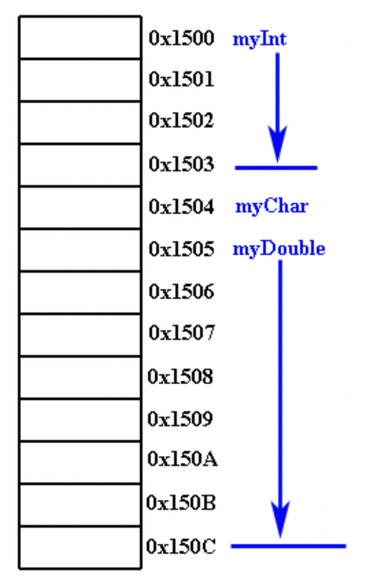
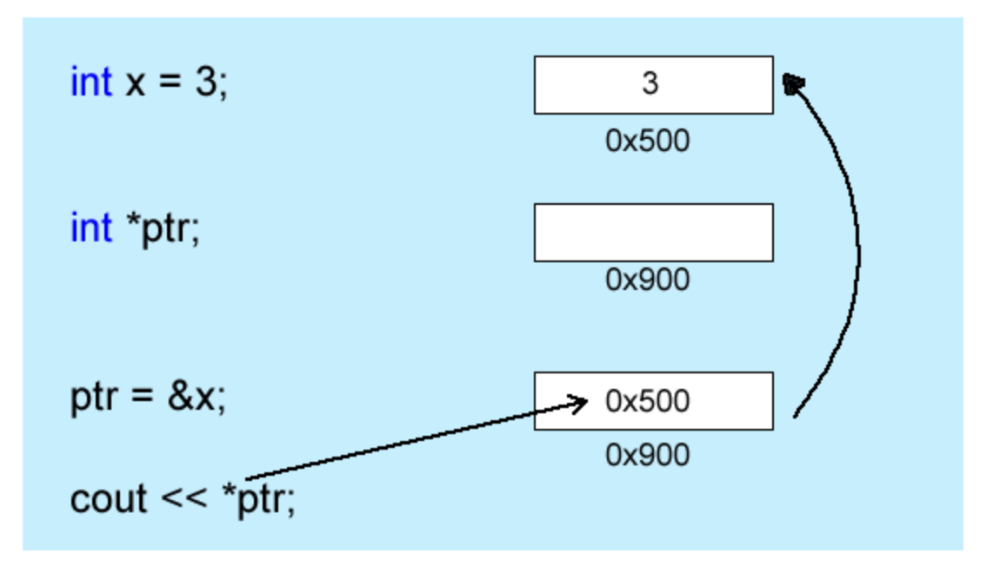

# Unit 7 - Dynamic Memory Allocation

## Pointer Review

* A pointer is a special type of variable, which holds the address of another variable
    * & addressof operator (The same symbol that is used for references)
    * \* dereference operator (contents of the operator)

* When creating variables, the compiler allocates enough memory to hold the specified type, create an association between the name of the variable and the allocated memory location, and if needed initalizes the memory with the specified value
    * The compiler will allocate space on the stack starting at the next memory location



* myDouble was created on the stack at memory address 0x1505; a double is 8 bytes long so it occupies 8 consecutive memory locations

```cpp
//output the address of myInt which is 0x1500
cout << &myInt << endl;

//output the address of myChar which is 0x1504
cout << &myChar << endl;

// output the address of myDouble which is 0x1505
cout << &myDouble << endl
```

## Initalizing a Pointer

```cpp
in *p;  // Asterisk is used to indicate variable is a pointer
```

```cpp
int *ptr;
int x = 3;
ptr = &x 
```



```cpp
int main()
{
int x = 3;
int *ptr = & x;
    cout << ptr << endl;     // prints  0x500 because this is the address stored in the pointer variable.   
    cout << *ptr << endl;   // prints out 3 because this is what the pointer is referring to (what is stored in x).
    cout << &ptr << endl;  // prints out 0x900 because this is the address where the pointer sits in memory.
}
```

## Pointer Math

```cpp
ptr++;  // move the pointer ahead by one
ptr+=5;  // add 5 to the address of the pointer
```

```cpp
int *ptr;
ptr++;  // Moves the pointer 4 bytes because the int data type is 4 bytes wide
```

```cpp
int main()
{	
	int x = 30;
	char *ptr = (char *) &x;
	ptr++;    //Moves the pointer ahead by one byte not 4

	cout << *ptr << endl;
	
	return 0;
}
```

## Pointers and Arrays

```cpp
int[] ar = {2,3,5,6,2,7,8,9,0,12,14,15};
int *ptr = ar;         // equivalent to ptr = &ar[0];
for(int i = 0; i < size; i++)
    cout << *ptr++ << endl;
```

## Pointers and Complex Types

```cpp
int main()
{
    Rectangle rect(5, 6);
    Rectangle *r = &rect;

    cout << "The area of the Rectangle is " << r->area() << endl;
    
    return 0;
}
```

## Example

```cpp
int countVowels(char *str)
{
int count = 0;
char *p;

       p = str; // Set the pointer to the beginning of the string
       
       while(*p)
       {
            switch(toupper(*p++))
            {
                 case 'A':
                 case 'E':
                 case 'I':
                 case 'O':
                 case 'U':
                      count++;
            }
       }
       return count;
}
```

* An array is a pointer, [] and * are practically the same
```cpp
int ar[] = {1,2,3,4,5,6};
int *p;
p = ar; 
```

* ar is equivalent to:

```cpp
p = &ar[0] 
```

# Dyanamic Memory Allocation

* Static Memory Allocation - fixed size in memory
* There are instances where you need to increase the size of an array and it can only be determined at runtime -> Dynamic Memory Allocation

## The new operator

* Returns an address to the memory that was requested
    * Address returned is called an anonymous pointer because it does not have a variable to reference it
```cpp
int *p = new int; // allocate memory for a new int and assign the memory to p 
```

* Useful to declare memory with arrays

```cpp
int main()
{
   int size;

   cout << "How many numbers do you want to create?" << endl;
   cin >> size;

   int *myArray = new int[size];    // Allocate an array of the requested size

   for(int i = 0; i < size; i++)
      myArray[i] = rand() % 101;

   return 0;
}
```

* The difference between declaring a normal array and assigning memory to a pointer is that the size of the array must be a constant value, while the other allows for the creation of the necessary memory needed while the program is executing

## Using new with Complex Types

* It is simply more efficient to dynamically create large objects and delete them when finished

```cpp
int main()
{
	vector vRect;

	int length, width;
	int times = 0;

	cout << "How many Rectangles do you want to create?" << endl;
	cin >> times;
	for (int i = 0; i < times; i++)
	{
		cout << "Enter a length and width " << endl;
		cin >> length >> width;
		vRect.push_back(new Rectangle(length, width));
	}

	return 0;
}
```

```cpp
for (vector<Rectangle *>::iterator p = vRect.begin(); p < vRect.end(); p++)
{
	Rectangle *r = *p;
	cout << r->area() << endl;
}
```

## Checking for Allocation feature

* If memory cannot be allocated the new operator will return null
    * Important to check the null pointer after attempting to allocate memory; attempting to add data to memory that was not allocated will crash

```cpp
int main()
{
    int *myArray;
  
    myArray = new int[5];
    if(myArray == NULL)
    {
          //Error creating memory. Take appropriate measures. 
    }
    return 0;
}
```

## Cleaning up memory with delete

* Memory created with new is allocated on the heap so it stays with the program through its lifetime
    * When your program exits, all of the dynamic memory gets freed
    * But many programs today run non-stop, don't get freed on their own

```cpp
int *myInt = new int;
myInt = 25;
delete myInt; // Finished with memory, free it up

Rectangle *rect = new Rectangle(5,3);
int theArea = rect->area();
delete theArea;   // Delete the memory allocated for the complex type

int *myArray = new int[10];
for(int i = 0; i < 10; i++)
    myArray[i] = rand() % 100;
delete[] myArray;   // When deleting memory allocated for an array you have to use [] 
```

## Memory Leaks

* Happens when the pointer that refers to dynamic memory is either reassigned or is deleted improperly
    * Remember new returns an anonymous pointer that you need to create a refernece to; you may end up with a memory block that has no reference
    * This means that it cannot be accessed or deleted anymore -> eats up space used for your program, leading to crashes

```cpp
// Leak 1
char *str;
str = new char[20];
str = new char[30;

delete[] str;
```

* In this example a pointer to a character array is created. It is first assigned to the new memory created by the new char[20] statement. Next the pointer is reassigned to a new block of memory. When the pointer is reassigned the existing memory exists in the system without a pointer to reference it. At the end delete is called but it will only delete what string is currently referring to (char[30]).

* Solution: Call delete to free up the memory before reassigning the pointer to a new block of memory.

```cpp
//Leak2
char *first_string = new char[20];
char *second_string = new char[20];
strcpy(first_string, "leak");
second_string = first_string;
strcpy(second_string, first_string);
delete [] second_string;
```

* The address of the dynamically created variable associated with second_string (as a side-effect of the pointer assignment) is lost so it can no longer be deleted from the heap. Thus the last line of code only frees the dynamic variable associated with first_string, which is not what is intended.

* Solution: delete the memory associated with second_string before the pointer reassignment: second_string = first_string;

```cpp
//Leak 3
void leak()
 { 
   int k;
    char *cp = new char('E');    
} 
```

* In this example a local pointer is created on the stack that refers to memory allocated on the heap. When the function exits the local pointer is wiped off the stack leaving the memory allocated on the heap without a reference. It is important to understand the scope of variables.

* Solution - Pass the pointer through the argument list. If this is part of a class make the pointer a field variable of the class.

## Smart pointers

* A smart pointer is a class type that acts like a built-in pointer 
    * A complex type that is designed with the ability to handle its own memory cleanup
    * Don't need to worry about using delete, the smart pointer will free up memory for you

## Types of smart pointers

* Since it is built into the C++ langauge, some call it primitive pointers. Correct terminoloy is raw pointers

* unique_ptr - allows exactly one ownership for the underlying pointer. Can be moved to a owner but cannot be copied or shared
* shared_ptr - Reference counter pointer. Contains a reference counter that gets increased each time you assign it. Handy when dealing with container types like the vector. Wrap elements from the vector in a shared_ptr and copy it to other containers
* weak_ptr - used in conjunction with a shared_ptr. Gives access to the object that is owned by a shared_ptr. Does not increase the reference counter. When you want to examine the object but not modify the reference count

## Using Smart Pointers

```cpp
#include <memory> 
#include <iostream>
#include "Rectangle.h"

using namespace std;

int main()
{
	int length, width;

	cout << "Enter the length and width for the Rectangle" << endl;
	cin >> length >> width;

	unique_ptr<Rectangle> r1(new Rectangle(length, width));

	cout << r1->area() << endl;
        return 0;
} 
```

```cpp
int main()
{	
	vector<unique_ptr<Rectangle>> vRect;

	int length, width;
	int times = 0;

	cout << "How many Rectangles do you want to create?" << endl;
	cin >> times;
	for (int i = 0; i < times; i++)
	{
		cout << "Enter a length and width " << endl;
		cin >> length >> width;
		vRect.push_back(unique_ptr<Rectangle>(new Rectangle(length, width)));
	}
		
	//Print out the vector
	for (vector<unique_ptr<Rectangle>>::iterator p = vRect.begin(); p < vRect.end(); p++)
	{
		unique_ptr<Rectangle> r = move(*p);  //Use move to transfer the contents of the object to the pointer
		cout << r->area() << endl;
	}
	
	return 0;
}
```

